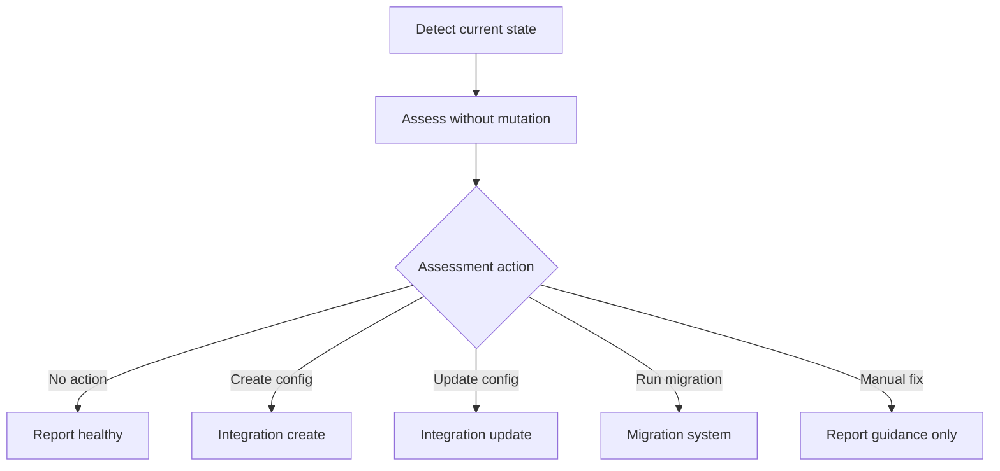

# Architecture

Adamantite is a preset package and CLI that applies and maintains code-quality tooling in
a target project. Product behavior is documented in the [README](../README.md), domain
terms live in [CONTEXT.md](../CONTEXT.md), and durable tradeoffs belong in
[decision records](./adr/README.md).

## Runtime

`src/index.ts` starts the Effect runtime. `src/cli.ts` defines the command tree and command
options. Command modules validate command-specific input, obtain Effect services, and
invoke target-project operations.

`@effect/platform-node` supplies the production filesystem, path, process, and terminal
services. Other external behavior, such as prompts and child commands, is also behind
services so command behavior can be tested without changing a real project.

Bunup bundles the CLI and presets into `dist`. The `bin/adamantite` executable loads the
bundled CLI.

## Module seams

| Module         | Responsibility                                                                         |
| -------------- | -------------------------------------------------------------------------------------- |
| `commands`     | Define one CLI workflow and render its user-facing result.                             |
| `execution`    | Run child commands and carry forwarded arguments to them.                              |
| `integrations` | Detect and maintain supported tooling, editor, workspace, and CI state.                |
| `migrations`   | Perform one-time transitions from legacy state.                                        |
| `workspace`    | Read and write target-project files, install dependencies, and derive workspace state. |
| `shared`       | Define assessments, errors, filesystem helpers, and JSON helpers.                      |
| `terminal`     | Prompt the user and render the CLI title.                                              |
| `presets`      | Publish lint, format, analysis, and TypeScript configuration.                          |

Integration modules export only the integration itself as a default export.
`src/lib/integrations/base.ts` is the shared infrastructure exception. Reusable behavior
belongs in a nearby workspace or shared module instead of a named integration export.

## Integration lifecycle



`assess` is always read-only. It must not write files or call migrations. `doctor` reports
the resulting assessments. `doctor --fix` is the only dispatcher that turns assessment
actions into mutations; manual fixes remain report-only.

Migrations may call integrations to reach the latest supported shape. Integrations must
not call migrations. This dependency direction keeps normal maintenance separate from
one-time legacy transitions.

`init` creates selected setup for a target project. It does not orchestrate migrations. If
it finds existing setup that it intentionally leaves unchanged, it warns the user and
points to `adamantite doctor` or `adamantite doctor --fix`.

## Command boundaries

- `check`, `fix`, and `format` run Oxlint or Oxfmt.
- `analyze` runs Knip.
- `monorepo` runs Sherif.
- `init` creates selected integrations and managed scripts.
- `doctor` assesses managed integrations; `doctor --fix` applies safe assessment actions.
- `update` runs applicable migrations and updates managed dependencies.
- `typecheck` is a deprecated alias for `check`.

Commands that wrap one underlying tool can forward arguments after `--`. Lifecycle
commands do not forward arguments because they coordinate multiple operations.

## Source layout

```text
presets/
  lint/             published Oxlint presets
  analyze.ts        published Knip preset
  format.ts         published Oxfmt preset
  tsconfig.json     published TypeScript preset
src/
  commands/         CLI workflows
  lib/
    execution/      child command runs and forwarded arguments
    integrations/   tooling, editor, and CI adapters
    migrations/     one-time legacy transitions
    shared/         cross-cutting types and helpers
    workspace/      target-project state and file operations
  terminal/         user prompting and title output
  cli.ts            command definition
  index.ts          composition root and runtime boundary
```

## Dependency version invariant

A tooling integration records the version that Adamantite installs in target projects.
When the corresponding dependency version in `package.json` increases, update the version
in `src/lib/integrations/tooling` to match.
