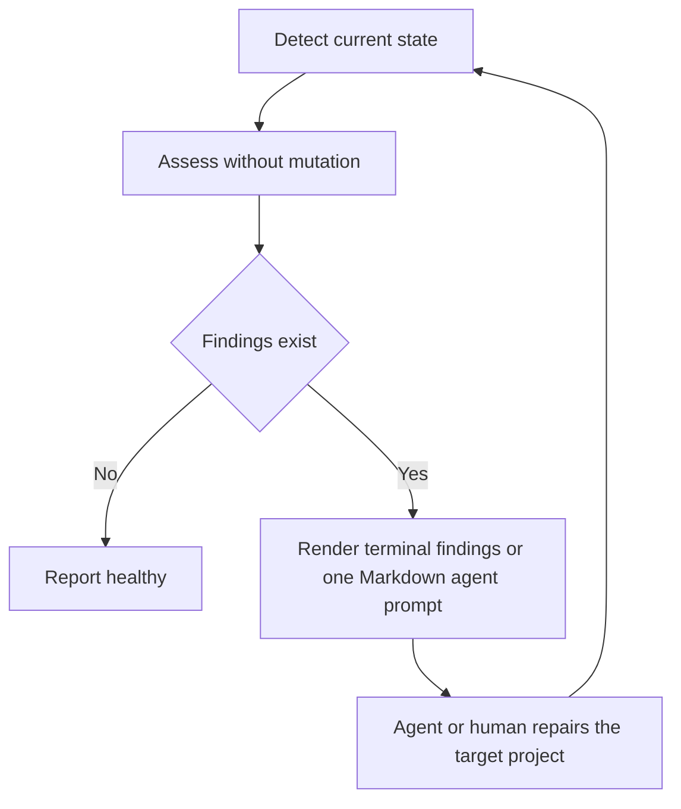

# Architecture

Adamantite is a preset package and CLI that applies and maintains code-quality tooling in
a target project. Product behavior is documented in the [README](../README.md), domain
terms live in [CONTEXT.md](../CONTEXT.md), and durable tradeoffs belong in
[decision records](./adr/README.md).

## Runtime

`src/index.ts` starts the Effect runtime. `src/cli.ts` defines the command tree and command
options. Command modules validate command-specific input, obtain Effect services, and
invoke target-project operations.

`@effect/platform-node` supplies the production filesystem, path, process, and terminal
services. Other external behavior, such as prompts and child commands, is also behind
services so command behavior can be tested without changing a real project.

Tsdown bundles the CLI and presets into `dist`. Unplugin macros expands compile-time
package metadata and terminal-title values during builds and Vitest source transforms.
The `bin/adamantite` executable loads the bundled CLI. Repository tests run with Vitest
under Node.js. A packaged smoke test keeps Bun runtime compatibility covered.

## Module seams

| Module         | Responsibility                                                                                               |
| -------------- | ------------------------------------------------------------------------------------------------------------ |
| `commands`     | Define one CLI workflow and render its user-facing result.                                                   |
| `execution`    | Run child commands, define coding-agent handoff, and carry forwarded arguments.                              |
| `integrations` | Detect supported tooling, editor, workspace, and CI state, and assess the project against the managed ideal. |
| `workspace`    | Read and write target-project files, install dependencies, and derive workspace state.                       |
| `shared`       | Define errors, filesystem helpers, and JSON helpers.                                                         |
| `terminal`     | Prompt the user and render the CLI title.                                                                    |
| `presets`      | Publish lint, format, analysis, and TypeScript configuration.                                                |

Integration modules export only the integration itself as a default export.
`src/lib/integrations/base.ts` and `src/lib/integrations/assessment.ts` are the shared
infrastructure exceptions. Reusable behavior belongs in a nearby workspace or shared
module instead of a named integration export.

## Integration lifecycle



`assess` and `doctor` are always read-only. Each finding contains the current state, the
goal criteria, and optional reference content or notes. The agent or the human changes the
target project. A later Doctor run confirms whether the project reached the goal state.
Interactive Doctor runs render findings as terminal notes, then offer to hand off to an
installed coding agent CLI or to copy the combined Markdown prompt. Installation is
detected by probing each supported CLI's version command, bounded by a timeout; only
agents whose probe command starts appear in the menu. A handoff hands the terminal to
the agent CLI with inherited stdio
and a per-agent seed argument that tells the agent to run Doctor itself; Adamantite
passes no provider permission, sandbox, or trust flags, and reassesses once after the
agent session ends.
The agent's exit code is ignored: only the reassessment decides success. Non-interactive runs
print the Markdown prompt directly when findings remain. If an assessment reports only
warnings, a non-interactive run prints a Markdown warning report and exits 0.

Package drift also stays structured so that `update` can install current managed package
versions. Doctor renders package drift as findings that tell the user to run `update`.

`init` creates selected setup for a target project. If it preserves existing setup, it
warns the user and points to `adamantite doctor`.

## Command boundaries

- `check`, `fix`, and `format` run Oxlint or Oxfmt.
- `analyze` runs Knip.
- `monorepo` runs Sherif.
- `init` creates selected integrations and managed scripts.
- `doctor` assesses managed integrations and emits repair findings.
- `update` updates managed dependencies, then emits any remaining doctor findings.

Commands that wrap one underlying tool can forward arguments after `--`. Lifecycle
commands do not forward arguments because they coordinate multiple operations.

## Source layout

```text
presets/
  lint/             published Oxlint presets
  analyze.ts        published Knip preset
  format.ts         published Oxfmt preset
  tsconfig.json     published TypeScript preset
src/
  commands/         CLI workflows
  lib/
    execution/      child command runs, coding-agent handoff, forwarded arguments
    integrations/   tooling, editor, and CI adapters; project assessment
    shared/         cross-cutting types and helpers
    workspace/      target-project state and file operations
  terminal/         user prompting and title output
  cli.ts            command definition
  index.ts          composition root and runtime boundary
```

## Dependency version invariant

A tooling integration records the version that Adamantite installs in target projects.
When the corresponding dependency version in `package.json` increases, update the version
in `src/lib/integrations/tooling` to match.

## Vendored bundles

A preset can ship a vendored bundle of a third-party plugin whose upstream deliberately
does not publish to npm. Bundles live under `presets/lint/vendor/`, are generated by
`scripts/vendor-plugins.ts` from a pinned upstream commit with dependencies inlined, and
are checked in with their license attribution, so target projects install nothing extra.
To update one, bump its pinned ref in the script's plugin list, re-run the script, review
the upstream diff, and adjust the owning preset's rules if rules were added, removed, or
renamed; each preset's drift test catches a mismatch.
