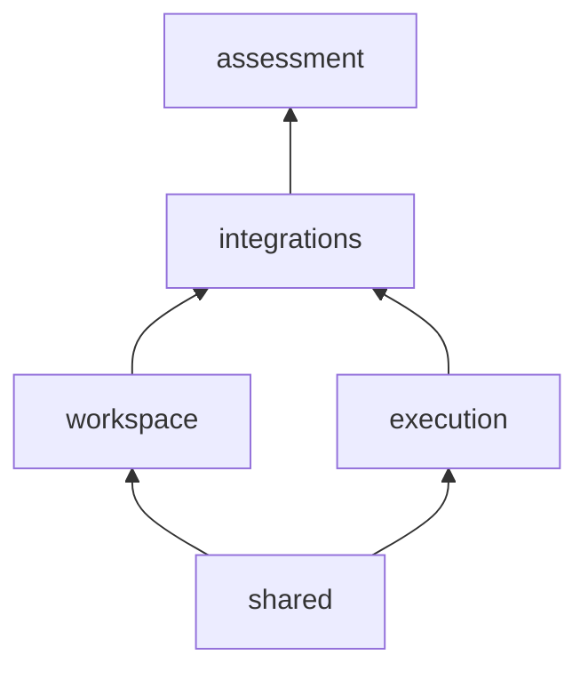
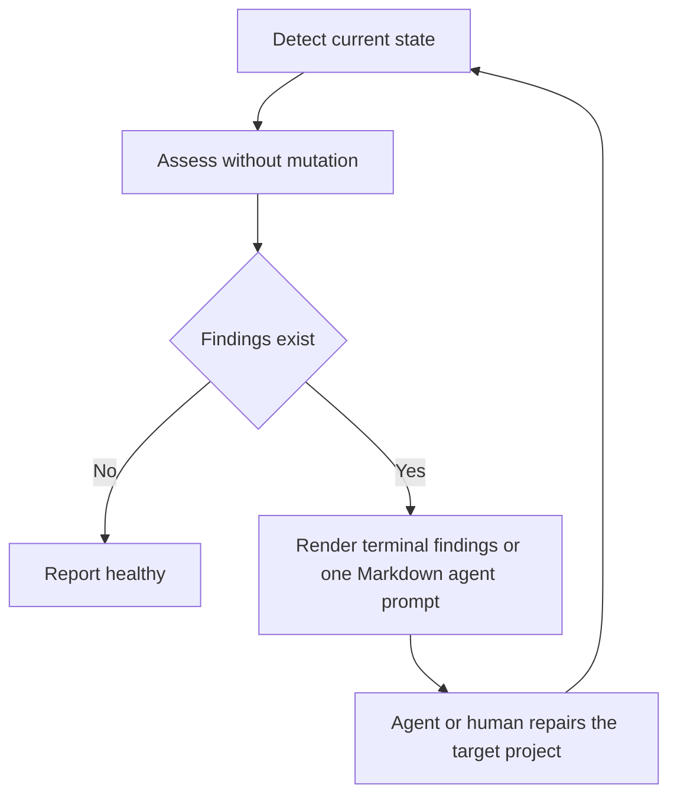

# Architecture

Adamantite is a preset package and CLI that applies and maintains code-quality tooling in
a target project. Product behavior is documented in the [README](../README.md), domain
terms live in [CONTEXT.md](../CONTEXT.md), and durable tradeoffs belong in
[decision records](./adr/README.md).

## Runtime

`src/index.ts` starts the Effect runtime. `src/cli.ts` defines the command tree and command
options. Command modules validate command-specific input, obtain Effect services, and
invoke target-project operations.

`@effect/platform-node` supplies the production filesystem, path, process, and terminal
services. Other external behavior, such as prompts and child commands, is also behind
services so command behavior can be tested without changing a real project.

Tsdown bundles the CLI and presets into `dist`. Unplugin macros expands compile-time
package metadata and terminal-title values during builds and Vitest source transforms.
The `bin/adamantite` executable loads the bundled CLI. Repository tests run with Vitest
under Node.js. A packaged smoke test keeps Bun runtime compatibility covered.

## Module seams

| Module         | Responsibility                                                                                            |
| -------------- | --------------------------------------------------------------------------------------------------------- |
| `commands`     | Define one CLI workflow and render its user-facing result.                                                |
| `execution`    | Run child commands, define coding-agent handoff, and carry forwarded arguments.                           |
| `assessment`   | Register every managed integration, assess the project, and render the Markdown agent prompt.             |
| `integrations` | Detect supported tooling, editor, workspace, and CI state, and assess each one against the managed ideal. |
| `workspace`    | Read and write target-project files, install dependencies, and derive workspace state.                    |
| `shared`       | Define errors, filesystem helpers, and JSON helpers.                                                      |
| `terminal`     | Prompt the user and render the CLI title.                                                                 |
| `presets`      | Publish lint, format, analysis, and TypeScript configuration.                                             |

## Lib layers

The modules in `src/lib` form layers. A layer imports only from the layers below it:


```mermaid
flowchart BT
  shared --> workspace
  shared --> execution
  workspace --> integrations
  execution --> integrations
  integrations --> assessment
```

`workspace` and `execution` are siblings and do not import each other. `workspace` knows
target-project files and package state, but not integration types such as `Finding`.
The `no-restricted-imports` overrides in `oxlint.config.ts` enforce the direction, so an
import from a higher layer fails `pnpm run check`. Lib modules import other lib modules
through `#lib/...`, not parent-relative paths, so the layer rules see every import.
`src/__tests__/lint/lib-layers.test.ts` runs Oxlint with these overrides to check both
import forms.

Inside `integrations`, `base.ts` defines the integration and finding types.
`tooling/base.ts` and `tooling/preset-config.ts` hold the logic that several tools share.
Each tool has a folder: `index.ts` exports only the integration as a default export, and
helper modules beside it, such as `knip/config.ts`, hold the logic that only that tool
uses. The `assessment` layer is the only module that imports every integration.

## Integration lifecycle


```mermaid
flowchart TD
  A[Detect current state] --> B[Assess without mutation]
  B --> C{Findings exist}
  C -->|No| D[Report healthy]
  C -->|Yes| E[Render terminal findings or one Markdown agent prompt]
  E --> F[Agent or human repairs the target project]
  F --> A
```

`assess` and `doctor` are always read-only. Each finding contains the current state, the
goal criteria, and optional reference content or notes. The agent or the human changes the
target project. A later Doctor run confirms whether the project reached the goal state.
Tooling config generators produce only the current setup for `init` and Doctor reference
content. They do not convert existing configs or generate patches.
Interactive Doctor runs render findings as terminal notes, then offer to hand off to an
installed coding agent CLI or to copy the combined Markdown prompt. Installation is
detected by probing each supported CLI's version command, bounded by a timeout; only
agents whose probe command starts appear in the menu. A handoff hands the terminal to
the agent CLI with inherited stdio
and a per-agent seed argument carrying the combined Markdown prompt; Adamantite
passes no provider permission, sandbox, or trust flags, and reassesses once after the
agent session ends.
The agent's exit code is ignored: only the reassessment decides success. Non-interactive runs
print the Markdown prompt directly when findings remain. If an assessment reports only
warnings, a non-interactive run prints a Markdown warning report and exits 0.

Package drift also stays structured so that `update` can install current managed package
versions. Doctor renders package drift as findings that tell the user to run `update`.

`init` creates selected setup for a target project. If it preserves existing setup, it
warns the user and points to `adamantite doctor`.

## Command boundaries

- `check` and `fix` run Oxfmt and Oxlint.
- `analyze` runs Sherif in a detected monorepo, then Knip. `--only` selects one stage.
- `init` creates selected integrations and managed scripts.
- `doctor` assesses managed integrations and emits repair findings.
- `update` updates managed dependencies, runs the managed plugins' `prepare` steps, then
  emits any remaining doctor findings.
- `prepare` runs the managed plugins' `prepare` steps. The target project's `prepare` script
  runs it after each install.

Commands that wrap one underlying tool can forward arguments after `--`. Lifecycle
commands do not forward arguments because they coordinate multiple operations.

## Source layout

```text
presets/
  lint/             published Oxlint presets
    plugin/         first-party Oxlint plugin and its rules
    vendor/         vendored plugin bundles
  analyze.ts        published Knip preset
  format.ts         published Oxfmt preset
  tsconfig.json     published TypeScript preset
src/
  commands/         CLI workflows
  lib/
    shared/         errors, filesystem, and JSON helpers (bottom layer)
    workspace/      target-project state and file operations
    execution/      child command runs, coding-agent handoff, forwarded arguments
    integrations/   integration types, then tooling, editor, workspace, and CI adapters
      tooling/      shared tooling infrastructure and one folder for each tool
    assessment/     integration registry, project assessment, agent prompt (top layer)
  terminal/         user prompting and title output
  cli.ts            command definition
  index.ts          composition root and runtime boundary
```

## Dependency version invariant

A tooling integration records the version that Adamantite installs in target projects.
When the corresponding dependency version in `package.json` increases, update the version
in `src/lib/integrations/tooling` to match. Packages that belong to Oxlint sit under
`tooling/oxlint/`: Tsgolint beside the integration, managed plugins in `plugins/`.

## Managed plugins

A preset can need a third-party Oxlint plugin that is published on npm, such as
`@shadcn/lint` for the `shadcn` preset and `oxlint-plugin-react-doctor` for the
`react-doctor` preset. The plugin stays an npm package in the target
project. Its tooling integration lives in `src/lib/integrations/tooling/oxlint/plugins/`
and is made with `defineManagedPlugin` from `plugins/define.ts`, so the package is required only while
`oxlint.config.ts` imports the preset. Register a new plugin in the `managedPlugins` list in
that folder's `index.ts`; init and doctor read the list. The preset names the plugin by its bare package name
in `jsPlugins`, and Oxlint resolves it from the target project. The pin is the devDependency
version in `package.json`. See ADR 0003.

`@effect/tsgo` for the `effect` preset is a managed plugin too, but it is not a `jsPlugins`
package. Its `effecttsgo` rules exist only after `effect-tsgo patch --oxlint --typescript`
replaces the Oxlint and TypeScript binaries in `node_modules`. A managed plugin can give
`defineManagedPlugin` a `prepare` step for this kind of install work. While the plugin
applies, `adamantite prepare` runs the step from the target project's `prepare` script, and
`init` and `update` run it after they install packages. The `@effect/tsgo` integration also
manages that `prepare` script and the `@effect/language-service` entry in `tsconfig.json`. The Knip integration requires
`ignoreDependencies.effect` while `oxlint.config.ts` imports the preset. A test asserts that
`@effect/tsgo` ships patched binaries for the pinned Oxlint, oxlint-tsgolint, and TypeScript
versions. See ADR 0007.

## Vendored bundles

A preset can ship a vendored bundle of a third-party plugin whose upstream deliberately
does not publish to npm. Bundles live under `presets/lint/vendor/`, are generated by
`scripts/vendor-plugins.ts` from a pinned upstream commit with dependencies inlined, and
are checked in with their license attribution, so target projects install nothing extra.
To update one, bump its pinned ref in the script's plugin list, re-run the script, review
the upstream diff, and adjust the owning preset's rules if rules were added, removed, or
renamed; each preset's drift test catches a mismatch.

Each enabled rule of a bundle has `valid/` and `invalid/` fixtures under
`src/__tests__/presets/fixtures/<preset>/<rule>/`, one case per file. The harness in
`src/__tests__/presets/rule-fixtures.ts` lints them through the preset in one real Oxlint
run, so a re-vendor that tightens or relaxes a rule fails the fixture of that case. Add
fixtures when a rule is added, and move or change a fixture only when the upstream change
is accepted.

Each rule also has an in-process test under `src/__tests__/vendor/<bundle>/<rule>.test.ts`
that runs the rule object from the bundle through `RuleTester` from `oxlint/plugins-dev`.
These cases pin what the fixture run cannot: the message id, the placeholder data, the
report line and column, and the effect of rule options. They run with the unit tests. The
generated `plugin.d.mts` names each rule, so a test addresses its rule without a cast. When
a re-vendor moves a report or renames a message, update the case and record the accepted
upstream change in the pull request.

## First-party plugin

Rules that no upstream plugin provides live in Adamantite's own Oxlint plugin under
`presets/lint/plugin/`, with one module per rule in `rules/`. `options.ts` reads rule
options for all rules. `index.ts` registers each
rule under the `adamantite` namespace. Tsdown builds the plugin with the presets, so it
ships at `dist/presets/lint/plugin/index.js`.

A preset loads the plugin with a file URL from its own location, as the antislop preset
loads its vendored bundle. The source tree has `plugin/index.ts` and the dist tree has
`plugin/index.js`, so the preset takes the extension from its own module URL. Rule code
runs under the runtime that executes Oxlint in the target project, so it uses only
runtime-neutral APIs. It imports only types from `@oxlint/plugins`, a devDependency pinned
to the Oxlint version. `presets/lint/plugin/tsconfig.json` lets the source import rule
modules with their `.ts` extension, which Node.js needs to load the source plugin.

Each rule has a `RuleTester` test under `src/__tests__/plugin/<rule>.test.ts` for messages,
locations, and options, and `valid/` and `invalid/` fixtures under
`src/__tests__/presets/fixtures/<preset>/<rule>/` that the preset test lints in one real
Oxlint run.
